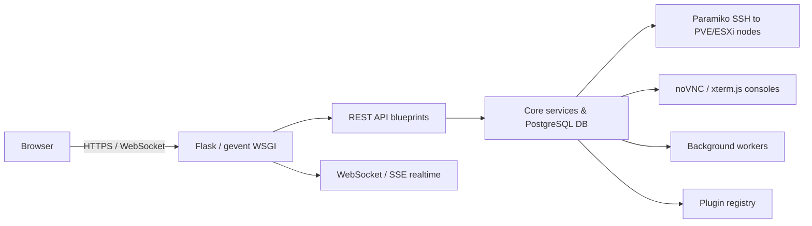

# ProxmoxVEx

Modern Multi-Cluster Management for Proxmox VE & ESXi

[](https://app.aikido.dev/audit-report/external/aklfeBsCvIheXnWMwFRveeH5/request)

---

ProxmoxVEx is a web-based management layer for Proxmox VE and ESXi clusters. It provides a single dashboard to monitor, operate, and automate virtual machines, containers, storage, backups, and users across multiple clusters from one place.


## Contents

- [What is ProxmoxVEx](#what-is-proxmoxvex)
- [Why ProxmoxVEx](#why-proxmoxvex)
- [Key Capabilities](#key-capabilities)
- [Screenshots](#screenshots)
- [Architecture and Tech Stack](#architecture-and-tech-stack)
- [Plugin API](#plugin-api)
- [Requirements](#requirements)
- [Quick Start](#quick-start)
- [Installation](#installation)
- [Reverse Proxy](#reverse-proxy)
- [Cloudflare Tunnel](#cloudflare-tunnel)
- [Initial Configuration](#initial-configuration)
- [Environment Variables](#environment-variables)
- [API and Monitoring](#api-and-monitoring)
- [Security](#security)
- [Updating](#updating)
- [Directory Structure](#directory-structure)
- [Troubleshooting](#troubleshooting)
- [Development and Testing](#development-and-testing)
- [Support](#support)
- [License](#license)

## What is ProxmoxVEx

ProxmoxVEx sits between your browser and one or more Proxmox VE or ESXi clusters, exposing a unified interface for day-to-day virtualization operations. It is designed for homelabs, small service providers, and operations teams that need multi-tenant access control, scheduled automation, and centralized observability without logging into each cluster individually.

The project combines a Python/Flask backend with a React-based frontend, a PostgreSQL database, noVNC and xterm.js consoles, and a plugin architecture for extensibility.

## Why ProxmoxVEx

- **One dashboard for many clusters** — see health, resource usage, and alerts across all sites in real time.
- **Built for teams** — role-based access, multi-tenancy, LDAP/OIDC, and audit logging keep operations secure and accountable.
- **Automation out of the box** — schedule snapshots, rolling updates, backups, and cross-cluster replication.
- **Compliance and cost visibility** — cost chargeback, carbon estimates, right-sizing recommendations, and BSI/ISO/NIS2/SOC 2 mapping.
- **Air-gap ready** — all static assets are bundled locally; offline mode disables external lookups for classified networks.

## Key Capabilities

### Multi-Cluster Operations

- Unified dashboard for Proxmox VE and ESXi resources
- Live CPU, RAM, storage, and network metrics via Server-Sent Events and WebSockets
- One-click VM power actions and live migration
- Cross-cluster load balancing and storage-agnostic snapshot replication
- Cross-hypervisor migration from ESXi, including near-zero-downtime and offline options

### Lifecycle and Scheduling

- VM and LXC configuration editing, snapshots, and backups
- Tag-based or per-VMID snapshot schedules with retention pruning
- Backup verification: restore, boot, health-check, and cleanup
- Cloud-Init template library for fast provisioning
- Rolling node updates with automatic evacuation

### Access and Security

- Role-based access control with built-in and custom roles
- Multi-tenancy, IP allow/block lists, and VM-level ACLs
- TOTP and WebAuthn / FIDO2 two-factor authentication
- LDAP and OIDC support for Active Directory, Entra ID, Keycloak, Authentik, and others
- API tokens with bearer authentication
- PostgreSQL with field-level Fernet encryption for sensitive columns; database volume encryption is the operator's responsibility
- HMAC-signed, tamper-evident audit log
- CVE scanning and CIS hardening baseline checks

### Monitoring, Reporting, and Automation

- Prometheus-compatible `/api/metrics` endpoint
- Cost and chargeback reporting, power and carbon estimates
- Right-sizing recommendations and capacity forecasts
- Network topology visualization
- Compliance dashboards for BSI Grundschutz, ISO 27001, NIS2, and SOC 2
- Integrated syslog receiver and SIEM forwarding
- Config drift detection with alerting

### Plugins and Extensibility

- Client portal for customer self-service
- Public status page for NOC and status screens
- Notification routing via ntfy, Apprise, Slack, Discord, Microsoft Teams, and generic webhooks
- Plugin API for third-party extensions

For a complete feature list, see the [documentation site](https://docs.proxmoxvex.certrunnerx.com).

## Screenshots


## Architecture and Tech Stack

ProxmoxVEx is a Python web application with a single-page React frontend. It uses gevent for high-concurrency I/O, PostgreSQL for persistence, and Paramiko-based SSH for cluster operations.

### Component Overview



### Backend

- **Python 3.8+** with **Flask 3** and **Werkzeug 3**
- **gevent** for asynchronous, high-concurrency request handling
- **PostgreSQL** with field-level Fernet encryption for sensitive columns
- **Paramiko** for SSH and **websockets** for console tunnels
- **cryptography**, **argon2-cffi**, **pyotp**, **fido2** for security primitives
- **ldap3**, **PyJWT** for LDAP and OIDC authentication

### Frontend

- **React** single-page application
- **Tailwind CSS** and **Chart.js** for UI and metrics
- **noVNC** for QEMU graphical console
- **xterm.js** for LXC and SSH terminal sessions

### Protocols and Ports

| Port | Description                           |
| ---- | ------------------------------------- |
| 5000 | Main web UI and REST API              |
| 5001 | noVNC WebSocket (QEMU console)        |
| 5002 | xterm.js WebSocket (LXC/SSH terminal) |

## Plugin API

Plugins are Python packages dropped into `plugins/`. A valid plugin exports a `load(app)` function and a `manifest.json` file that declares routes, frontend iframes, and compatibility. Plugins run in-process and are trusted by default.

Layout:

```text
plugins/{plugin-name}/
├── manifest.json       # Required. Contract metadata.
├── __init__.py         # Required. Must export `load(app)`.
├── ui.html             # Optional. Frontend iframe markup (shared `plugin-ui.css` is injected automatically).
└── config.json         # Optional. Default configuration.
```

Plugin UIs automatically receive the shared `/static/css/plugin-ui.css` stylesheet; native plugins should include the same `<link>` manually. See [docs/architecture/plugin-contract.md](docs/architecture/plugin-contract.md) for the full contract.

## Requirements

- Python 3.8 or newer
- Proxmox VE 8.0+ or 9.0+, and/or ESXi
- A modern web browser
- `openssh-client` and `sshpass` for node-level SSH operations and password auth fallback

## Quick Start

The fastest way to try ProxmoxVEx is with Docker:

```bash
docker compose up -d
```

Then open `https://<host>:5000` and complete the first-run setup.

## Installation

### Option 1: Automated Install Script

The `deploy.sh` script fetches the current state of the main branch, creates a dedicated service user, and installs ProxmoxVEx to `/opt/ProxmoxVEx`.

```bash
curl -O https://proxmoxvex.local/deploy.sh
chmod +x deploy.sh
sudo ./deploy.sh
```

For a non-interactive install on a specific port:

```bash
sudo ./deploy.sh --port=443 --no-interactive
```

### Option 2: Debian Package

```bash
curl -fsSL https://git.gyptazy.com/api/packages/gyptazy/debian/repository.key -o /etc/apt/keyrings/gyptazy.asc
echo "deb [signed-by=/etc/apt/keyrings/gyptazy.asc] https://packages.gyptazy.com/api/packages/gyptazy/debian trixie main" | sudo tee /etc/apt/sources.list.d/gyptazy.list
sudo apt-get update
sudo apt-get install -y ProxmoxVEx
```

### Option 3: Docker

Use the pre-built image:

```bash
docker run -d --name ProxmoxVEx \
  -p 5000:5000 \
  -p 5001:5001 \
  -p 5002:5002 \
  -v ProxmoxVEx-config:/app/config \
  -v ProxmoxVEx-logs:/app/logs \
  --restart unless-stopped \
  ghcr.io/ProxmoxVEx/ProxmoxVEx:latest
```

Or build and run locally:

```bash
git clone https://proxmoxvex.local/source.git
cd ProxmoxVEx
docker build -t ProxmoxVEx .
docker run -d --name ProxmoxVEx \
  -p 5000:5000 \
  -p 5001:5001 \
  -p 5002:5002 \
  -v ProxmoxVEx-config:/app/config \
  -v ProxmoxVEx-logs:/app/logs \
  --restart unless-stopped \
  ProxmoxVEx
```

### Option 4: From Source

For development, testing, or full control over the deployment:

```bash
git clone https://proxmoxvex.local/source.git
cd ProxmoxVEx
python3 -m venv .venv
source .venv/bin/activate
pip install -r requirements.txt
python3 ProxmoxVEx_multi_cluster.py
```

### Running as a Systemd Service

After installation from the deploy script or .deb, ProxmoxVEx is usually managed by systemd:

```bash
sudo systemctl start ProxmoxVEx
sudo systemctl enable ProxmoxVEx
sudo systemctl status ProxmoxVEx
```

Logs are written to `logs/` and to the systemd journal:

```bash
sudo journalctl -u ProxmoxVEx -f
```

## Reverse Proxy

To run ProxmoxVEx behind nginx, enable reverse-proxy mode with `PROXMOXVEX_BEHIND_PROXY=true`. This disables the built-in HTTPS redirect and trusts `X-Forwarded-For` / `X-Forwarded-Proto` from the configured proxies.

Example nginx snippet:

```nginx
server {
    listen 443 ssl http2;
    server_name proxmoxvex.example.com;

    ssl_certificate     /etc/nginx/ssl/cert.pem;
    ssl_certificate_key /etc/nginx/ssl/key.pem;

    location / {
        proxy_pass http://127.0.0.1:5000;
        proxy_http_version 1.1;
        proxy_set_header Host $host;
        proxy_set_header X-Real-IP $remote_addr;
        proxy_set_header X-Forwarded-For $proxy_add_x_forwarded_for;
        proxy_set_header X-Forwarded-Proto $scheme;
        proxy_set_header Upgrade $http_upgrade;
        proxy_set_header Connection "upgrade";
        proxy_read_timeout 86400;
    }
}
```

Then start ProxmoxVEx with:

```bash
PROXMOXVEX_BEHIND_PROXY=true PROXMOXVEX_TRUSTED_PROXIES="10.0.0.0/8,127.0.0.1" python3 ProxmoxVEx_multi_cluster.py
```

## Cloudflare Tunnel

ProxmoxVEx runs three separate listeners:

- Main web/API server on `127.0.0.1:5000`
- VNC console WebSocket server on `127.0.0.1:5001`
- SSH/LXC terminal WebSocket server on `127.0.0.1:5002`

When `PROXMOXVEX_BEHIND_PROXY=true` is set, the frontend connects to the same public port (e.g. `443`) for all three. A Cloudflare Tunnel **must** route the WebSocket paths to the correct origin ports, and this only works reliably with a **locally-managed** `cloudflared` tunnel. Remotely-managed/token tunnels can duplicate the `101 Switching Protocols` handshake, causing the browser to fail with `Invalid frame header`.

### Create a local tunnel

```bash
cloudflared tunnel login
cloudflared tunnel create proxmoxvex-local
cloudflared tunnel route dns proxmoxvex-local proxmoxvex.example.com
```

This writes a `credentials.json` file, for example `/root/.cloudflared/<tunnel-uuid>.json`.

### Local `cloudflared` config

Edit `/etc/cloudflared/config.yml`:

```yaml
tunnel: <tunnel-uuid>
credentials-file: /root/.cloudflared/<tunnel-uuid>.json

ingress:
  - hostname: proxmoxvex.example.com
    path: "^/api/clusters/.*/(shellws|termwebsocket)"
    service: http://127.0.0.1:5002
    originRequest:
      noTLSVerify: true

  - hostname: proxmoxvex.example.com
    path: "^/api/clusters/.*/vms/.*/vncwebsocket"
    service: http://127.0.0.1:5001
    originRequest:
      noTLSVerify: true

  - hostname: proxmoxvex.example.com
    service: http://127.0.0.1:5000
    originRequest:
      noTLSVerify: true

  - service: http_status:404
```

Then point the systemd `ExecStart` at the config file:

```ini
ExecStart=/usr/bin/cloudflared --no-autoupdate --config /etc/cloudflared/config.yml tunnel run
```

Finally:

```bash
systemctl daemon-reload
systemctl restart cloudflared
```

### Notes

- Do not use `--token-file` / remotely-managed Cloudflare Tunnels for the WebSocket paths; they are known to produce double `101` responses (`Invalid frame header`) on `shellws`, `termwebsocket`, and `vncwebsocket`.
- `PROXMOXVEX_BEHIND_PROXY=true` and `PROXMOXVEX_TRUSTED_PROXIES="127.0.0.1"` should be set so the app trusts `X-Forwarded-*` headers from `cloudflared`.
- The VNC console uses port `5001` and the terminal uses port `5002`. Make sure both are explicitly routed; falling through to the `5000` Flask app will not work for these WebSocket endpoints.

## Initial Configuration

After starting ProxmoxVEx, open the web interface:

```text
https://<server-ip>:5000
```

1. Complete the first-run setup wizard to create the administrator account.
2. Go to **Settings > Clusters** and add your Proxmox VE or ESXi credentials.
3. Start managing your clusters.

### First-Run Security Notes

- A self-signed certificate is generated automatically if no custom certificate is provided. Replace it with a trusted certificate for production.
- The database is encrypted automatically on first boot on Linux x86_64 when a master key is available. Back up the key separately from the `config/` directory.

## Environment Variables

The following environment variables tune ProxmoxVEx runtime behavior. New deployments should use the `PROXMOXVEX_*` form; legacy mixed-case aliases are still accepted as compatibility shims.

### Networking

| Variable                     | Default                                                      | Description                                                          |
| ---------------------------- | ------------------------------------------------------------ | -------------------------------------------------------------------- |
| `PROXMOXVEX_HOST`            | `127.0.0.1` (or `0.0.0.0` / `::` with `PROXMOXVEX_BIND_ALL`) | IP address to bind the main web server.                              |
| `PROXMOXVEX_BIND_ALL`        | unset                                                        | Set to `1`, `true`, or `yes` to bind all interfaces.                 |
| `PROXMOXVEX_BEHIND_PROXY`    | unset                                                        | Set to `1`, `true`, or `yes` to disable SSL and trust proxy headers. |
| `PROXMOXVEX_TRUSTED_PROXIES` | unset                                                        | Comma-separated list of trusted proxy IPs or CIDRs.                  |
| `PROXMOXVEX_ALLOWED_ORIGINS` | unset                                                        | Comma-separated list of allowed CORS origins.                        |
| `PROXMOXVEX_HTTP_PORT`       | `80` (root) or `-1` (non-root)                               | HTTP redirect port. Use `-1` to disable.                             |
| `PROXMOXVEX_SSL_CERT_FILE`   | `config/ssl/cert.pem`                                        | Path to the SSL certificate used for the health check.               |

### Concurrency and Performance

| Variable                        | Default                   | Description                                        |
| ------------------------------- | ------------------------- | -------------------------------------------------- |
| `PROXMOXVEX_SERVER`             | `auto`                    | WSGI mode: `gevent`, `flask`, or `auto`.           |
| `PROXMOXVEX_WORKERS`            | `max(32, cpu_count * 16)` | Number of gevent greenlets for request handling.   |
| `PROXMOXVEX_NO_GEVENT`          | unset                     | Set to `1`, `true`, or `yes` to disable gevent.    |
| `PROXMOXVEX_NOFILE`             | system hard limit         | Target `RLIMIT_NOFILE` for the process.            |
| `PROXMOXVEX_THREADPOOL_SIZE`    | `50`                      | Size of the gevent threadpool.                     |
| `PROXMOXVEX_NODE_POOL_SIZE`     | `100`                     | Gevent pool for node status calls.                 |
| `PROXMOXVEX_NODE_STATUS_TTL`    | `5` (seconds)             | Cache TTL for node status; set `0` to disable.     |
| `PROXMOXVEX_TASKS_TTL`          | `3` (seconds)             | Cache TTL for task resolution; set `0` to disable. |
| `PROXMOXVEX_SSH_MAX_CONCURRENT` | `25`                      | Maximum concurrent SSH connections.                |
| `PROXMOXVEX_MAX_REQUEST_SIZE`   | `10 MB`                   | Maximum API request body size.                     |
| `PROXMOXVEX_MAX_UPLOAD_SIZE`    | `100 GB`                  | Maximum upload body size.                          |

### Security and Encryption

| Variable                          | Default | Description                                                      |
| --------------------------------- | ------- | ---------------------------------------------------------------- |
| `PROXMOXVEX_DB_KEY`               | unset   | Base64- or hex-encoded 32-byte master key.                       |
| `PROXMOXVEX_KEY_FILE`             | unset   | Filesystem path to the master key.                               |
| `PROXMOXVEX_DISABLE_AUTO_ENCRYPT` | unset   | Set to `1` to skip automatic DB encryption on first boot.        |
| `PROXMOXVEX_VERIFY_SSL`           | `1`     | Set to `0` to disable outbound TLS verification to cluster APIs. |

### Logging and Auditing

| Variable                      | Default | Description                                                  |
| ----------------------------- | ------- | ------------------------------------------------------------ |
| `PROXMOXVEX_LOG_LEVEL`        | unset   | Console logging level (`DEBUG`, `INFO`, `WARNING`, `ERROR`). |
| `PROXMOXVEX_FILE_LOG_LEVEL`   | `DEBUG` | File logging level.                                          |
| `PROXMOXVEX_DISABLE_FILE_LOG` | unset   | Set to `1` to disable file logging.                          |

### Rate Limiting

| Variable                     | Default | Description                       |
| ---------------------------- | ------- | --------------------------------- |
| `PROXMOXVEX_API_RATE_LIMIT`  | `1200`  | Maximum requests per rate window. |
| `PROXMOXVEX_API_RATE_WINDOW` | `60`    | Rate-limit window in seconds.     |

### Consoles

| Variable                         | Default                 | Description                                       |
| -------------------------------- | ----------------------- | ------------------------------------------------- |
| `PROXMOXVEX_VNC_CONNECT_TIMEOUT` | `15` (seconds)          | VNC connect timeout.                              |
| `PROXMOXVEX_SSH_WS_PORT`         | `5002`                  | SSH WebSocket port.                               |
| `PROXMOXVEX_SSH_WS_HOST`         | `127.0.0.1`             | SSH WebSocket bind host.                          |
| `PROXMOXVEX_SSH_WS_SSL_CERT`     | unset                   | SSH WebSocket SSL certificate.                    |
| `PROXMOXVEX_SSH_WS_SSL_KEY`      | unset                   | SSH WebSocket SSL key.                            |
| `PROXMOXVEX_URL`                 | `http://127.0.0.1:5000` | ProxmoxVEx URL used by the SSH WebSocket backend. |

### Internal / Advanced

| Variable                        | Default     | Description                                               |
| ------------------------------- | ----------- | --------------------------------------------------------- |
| `PROXMOXVEX_REMOTE_TMP`         | `/tmp`      | Temporary directory for remote operations.                |
| `PROXMOXVEX_SYSLOG_BIND`        | `127.0.0.1` | Syslog receiver bind address.                             |
| `PROXMOXVEX_SYSLOG_BIND_ALL`    | unset       | Set to `1` to bind the syslog receiver on all interfaces. |
| `PROXMOXVEX_SYSLOG_TCP_MAX`     | `1024`      | Maximum concurrent TCP syslog clients.                    |
| `PROXMOXVEX_HEALTHCHECK_UNSAFE` | unset       | Set to `1` to skip health-check certificate verification. |
| `PROXMOXVEX_PKG_BASE`           | auto        | Custom package base path for plugin loading.              |

## API and Monitoring

### REST API

All API routes live under `/api/` and are protected by session cookie or `Authorization: Bearer pgx_<token>` header, except for the public blueprints listed below. API tokens are created in **Settings > API Tokens** and can be scoped to a role.

| Area               | Blueprint prefix | Purpose                                          |
| ------------------ | ---------------- | ------------------------------------------------ |
| `auth`             | `/api/auth`      | Login, logout, 2FA, WebAuthn, password reset     |
| `users`            | `/api/users`     | User and role management                         |
| `clusters`         | `/api/clusters`  | Cluster CRUD and credentials                     |
| `vms`              | `/api/vms`       | VM and container operations, consoles, migration |
| `nodes`            | `/api/nodes`     | Node status, metrics, and commands               |
| `storage`          | `/api/storage`   | Storage and Ceph management                      |
| `snapshots`        | `/api/snapshots` | Snapshot schedules and retention                 |
| `schedules`        | `/api/schedules` | Scheduled tasks                                  |
| `alerts`           | `/api/alerts`    | Alert rules and channels                         |
| `reports`          | `/api/reports`   | Cost, power, compliance, CVE reporting           |
| `metrics_exporter` | `/api/metrics`   | Prometheus OpenMetrics endpoint                  |
| `realtime`         | `/api/realtime`  | SSE and WebSocket live data                      |
| `settings`         | `/api/settings`  | Server, CORS, and branding settings              |
| `plugins`          | `/api/plugins`   | Plugin registry and configuration                |

### Public Endpoints

The following blueprints can be accessed without authentication, depending on server settings:

- `/api/auth` (login challenge, WebAuthn attestation)
- `/api/static_files` (frontend assets)
- `/api/realtime` (public status page data, when enabled)
- `/api/webauthn` (public attestation options)
- `/api/push` (web push subscription)
- `/api/metrics` (Prometheus; can be toggled public)

### Live Data

- **Server-Sent Events**: `GET /api/realtime/events?token=<sse_token>` for cluster and node metrics.
- **WebSocket**: `GET /api/ws/updates` for low-latency live updates; authenticate with a `session_id` JSON message after connect.

### Prometheus Metrics

Scrape `https://<host>:5000/api/metrics` with an API token:

```bash
curl -H "Authorization: Bearer pgx_<token>" \
     https://proxmoxvex.example.com:5000/api/metrics
```

The endpoint can also be made public in **Settings > Server** if you place ProxmoxVEx behind a mutual-TLS reverse proxy.

### Health Check

```bash
curl -k https://<host>:5000/api/health
```

## Security

Security is documented in detail in [`SECURITY.md`](SECURITY.md) and [`docs/SECURITY.md`](docs/SECURITY.md). Highlights include:

- **Database encryption at rest**: PostgreSQL volume encryption is the operator's responsibility; field-level Fernet encryption is used for sensitive columns.
- **Master key custody**: Multi-tier key loader supporting `PROXMOXVEX_DB_KEY`, systemd `LoadCredentialEncrypted`, `PROXMOXVEX_KEY_FILE`, and filesystem paths. The key should be backed up separately from `config/`.
- **Password storage**: Argon2id.
- **API token storage**: SHA-256 with constant-time comparison.
- **Transport**: HTTPS for production use; self-signed certificates are generated automatically if no certificate is provided.
- **Session management**: Time-limited sessions, optional IP binding, and per-endpoint rate limiting.
- **Input and access control**: server-side RBAC on every route, origin validation, and input sanitization.

## Updating

The recommended update path is the `update.sh` script:

```bash
cd /opt/ProxmoxVEx
curl -O https://proxmoxvex.local/update.sh
chmod +x update.sh
sudo ./update.sh
```

You can also check for updates from the web UI at **Settings > Updates**.

## Directory Structure

```text
/opt/ProxmoxVEx/
├── ProxmoxVEx_multi_cluster.py   # Entry point
├── ProxmoxVEx/                   # Backend application package
│   ├── app.py                    # Flask app factory
│   ├── constants.py              # Configuration constants
│   ├── globals.py                # Shared runtime state
│   ├── api/                      # REST API blueprints
│   ├── core/                     # Business logic, DB, cache
│   ├── background/               # Background workers
│   ├── cli/                      # Maintenance utilities
│   ├── utils/                    # Auth, RBAC, LDAP, OIDC
│   └── models/                   # Data models
├── web/                          # Frontend build
│   ├── index.html                # Compiled UI
│   └── src/                      # Frontend source
├── config/                       # Runtime configuration and database
├── static/                       # Offline JS/CSS libraries
├── logs/                         # Application logs
├── plugins/                      # Plugin packages
└── update.sh                     # Update script
```

## Troubleshooting

### Cannot reach the web UI

1. Verify the process is running: `sudo systemctl status ProxmoxVEx` or `docker ps`.
2. Check the bind address: by default the server binds `127.0.0.1` unless `PROXMOXVEX_BIND_ALL=true` or `PROXMOXVEX_HOST` is set.
3. Confirm the firewall allows TCP 5000, 5001, and 5002.

### Self-signed certificate warning

A self-signed certificate is generated on first start if no certificate is provided. Replace `config/ssl/cert.pem` and `config/ssl/key.pem` with a trusted certificate, or place ProxmoxVEx behind a reverse proxy that terminates TLS.

### Consoles (noVNC / xterm.js) do not work

- noVNC and the SSH terminal require a valid certificate on the WebSocket ports 5001 and 5002, or a reverse proxy that terminates TLS.
- Ensure ports 5001 and 5002 are reachable from the client.
- Set `PROXMOXVEX_BEHIND_PROXY=true` when running behind nginx and add WebSocket `Upgrade` headers.

### Database encryption

- If the master key is lost, the encrypted database is unreadable. Back up the key separately from `config/`.
- To check the active keystore tier: `python3 ProxmoxVEx_multi_cluster.py --keystore-status`.
- To migrate a plain database manually: `python3 ProxmoxVEx_multi_cluster.py --migrate-db --dry-run`.

### Rate limiting or session issues

- `PROXMOXVEX_API_RATE_LIMIT` and `PROXMOXVEX_API_RATE_WINDOW` control request throttling.
- Sessions expire after inactivity. Enable strict-IP binding in **Settings > Server** if required.

### Low file-descriptor limit

For 20+ clusters, increase the process limit:

```bash
# In the systemd unit override

[Service]
LimitNOFILE=65536
```

or set `PROXMOXVEX_NOFILE=65536`.

## Development and Testing

Install development dependencies and run the test suite:

```bash
python3 -m venv .venv
source .venv/bin/activate
pip install -r requirements.txt -r requirements-dev.txt
pytest
```

Linting and type checking:

```bash
ruff check ProxmoxVEx/
mypy --config-file pyproject.toml ProxmoxVEx/
```

### Release / CI tooling

The full release pipeline (`scripts/full-pipeline.sh`) and the packaging
helpers under `packaging/docker/` and `packaging/helm/` require:

- `helm` — Helm 3 chart linting, templating, and signing
- `trivy` — container and chart vulnerability scanning
- `hadolint` — Dockerfile linting

`deploy.sh` installs these tools automatically. If you are not using the
deploy script, install them manually before running the release pipeline.

## Support

- GitHub Issues: [ArMaTeC/ProxmoxVEx/issues](https://proxmoxvex.local/support)
- Email: [armatec0@gmail.com](mailto:armatec0@gmail.com)

## License

This project is licensed under the AGPL-3.0 License. See [LICENSE](LICENSE) for the full text.

Under Section 7(b) of the AGPL, the **"Powered by ProxmoxVEx"** attribution shown in the client portal is a required author attribution and must be preserved in every copy and derivative version. See [NOTICE](NOTICE) for details. AGPL section 13 additionally requires anyone hosting a modified version for network users to publish that version's complete source to those users.

---

Made by the ProxmoxVEx Team
